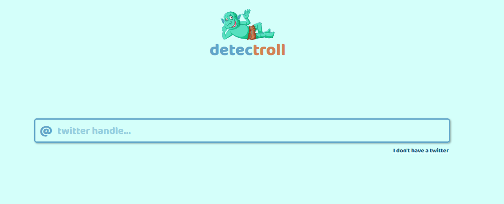

<h2 align="center">detecTroll</h2>

## Project Overview

detecTroll was created to educate about culture on the Internet and to identify people who spread disinformation and toxicity (trolls)





## Installation

```bash

git clone https://github.com/mcwiekala/detectroll.git

npm install

npm run start:dev

```

## Live 

http://detectroll.herokuapp.com/
