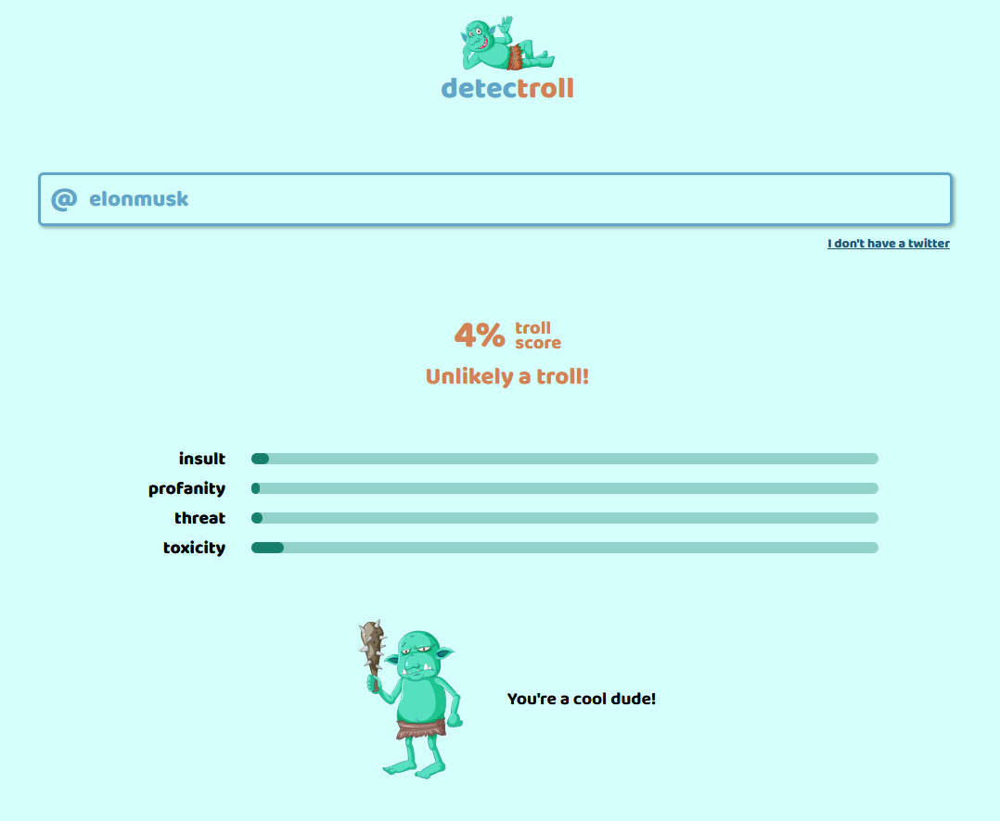
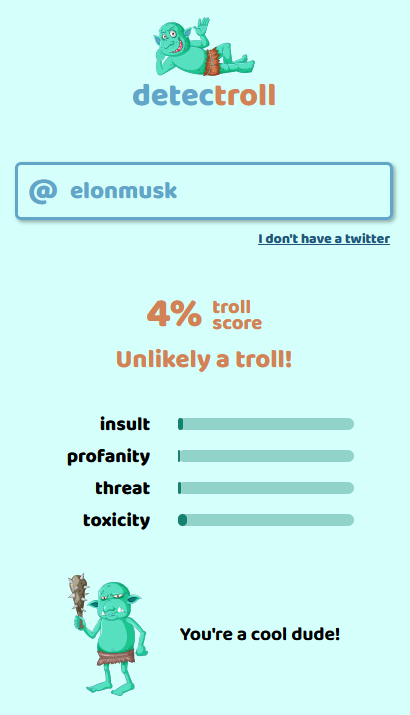

<h2 align="center">detecTroll</h2>

## Project Overview

detecTroll was created to educate about culture on the Internet and to identify people who spread disinformation and toxicity (trolls)







## Tech

detecTroll uses machine learning from Perspective API to gauge message content and Twitter API to get 3 last user tweets


## Troll attributes

insult - Insulting, inflammatory, or negative comment towards a person or a group of people.

profanity - Swear words, curse words, or other obscene or profane language.

threat - Describes an intention to inflict pain, injury, or violence against an individual or group.

toxicity - A rude, disrespectful, or unreasonable comment that is likely to make people leave a discussion.


## Installation

```bash

git clone https://github.com/mcwiekala/detectroll.git

npm install

npm run start:dev

```

## Live 

http://detectroll.herokuapp.com/
