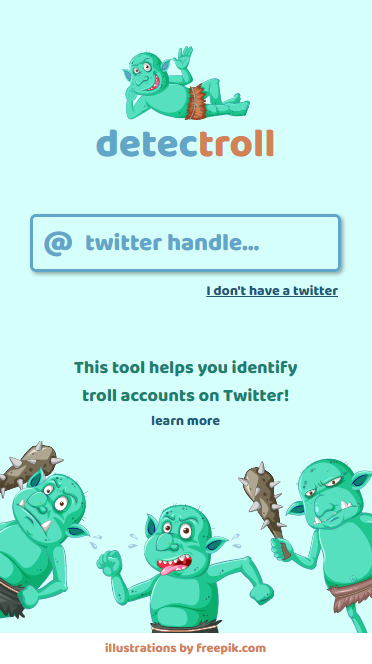
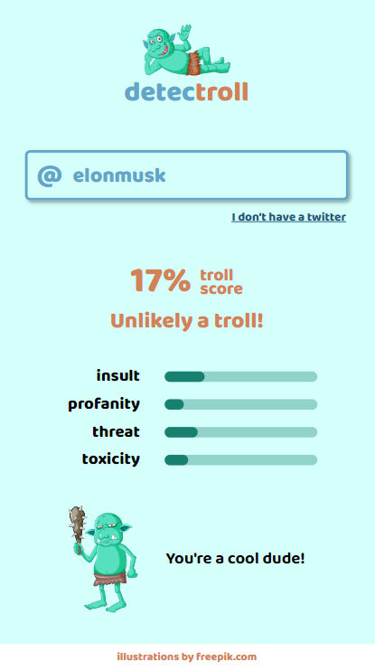

# DetecTroll

## Project Overview

This is a team project created during the Hack a Troll hackathon, where we received the audience award! 🥇

detecTroll was created to help identify troll accounts on Twitter and raise awareness about toxic behavior on the Internet.

## Live demo

http://detectroll.herokuapp.com/

Best viewed on mobile screens, as we didn't have enough time to fully design a desktop UI.

<p style="display:grid; grid-template-columns: 1fr 1fr; grid-gap: 1em; max-width: 700px; margin-bottom: 2em;">
     
     
</p>

## Team

- Michał Ćwiękała - mentor
- Krystian Gaczyński - frontend, UI
- Mateusz Binięda - frontend
- Karol Wolski - frontend
- Krzysztof Mackiewicz - backend, API integration
- Filip Glura - backend

## Technologies

### APIs

- Twitter API
- Perspective API

### Frontend

- React
- React Router
- React Hook Form
- Axios
- SCSS modules

### Backend

- Express

DetecTroll uses Twitter API to get 3 latest tweets by the specified user and send their content to Perspective API where the messages are evaluated in 4 categories: insult, profanity, threat, toxicity. These values are then used to calculate the total "troll score" and display a custom message, for example "Others may feel threatened by your words!"

## Installation

```bash
git clone https://github.com/mcwiekala/detectroll.git
npm install
npm run start:dev
```
